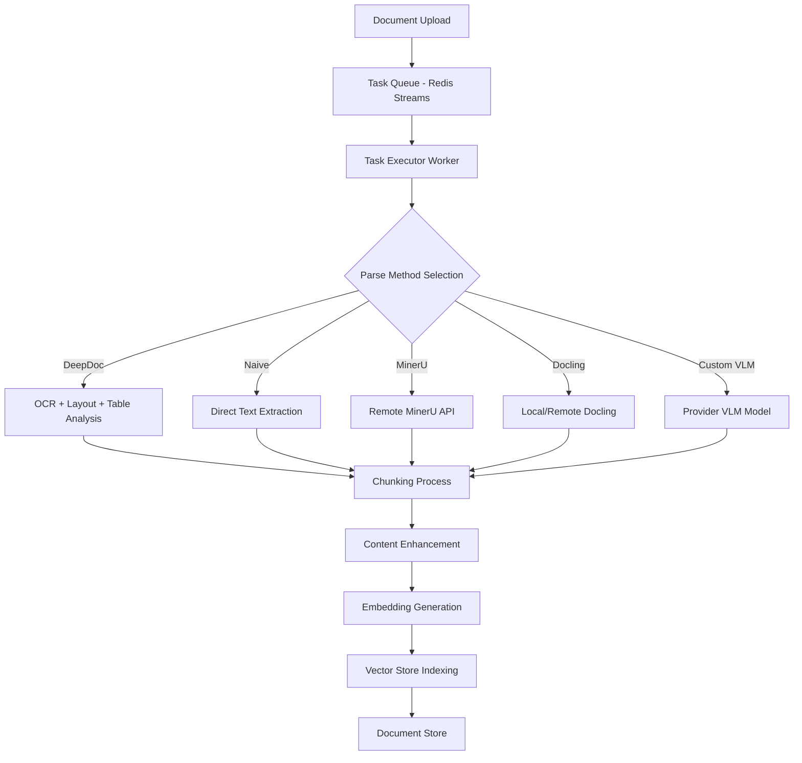
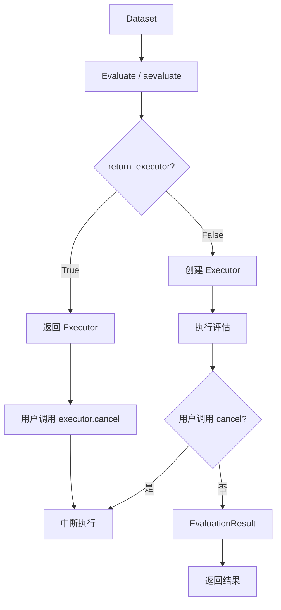
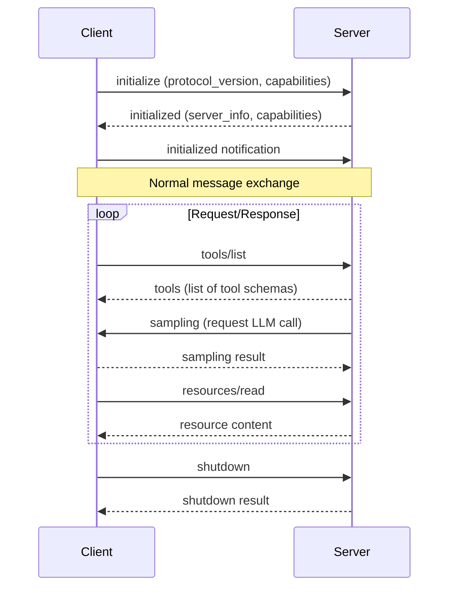
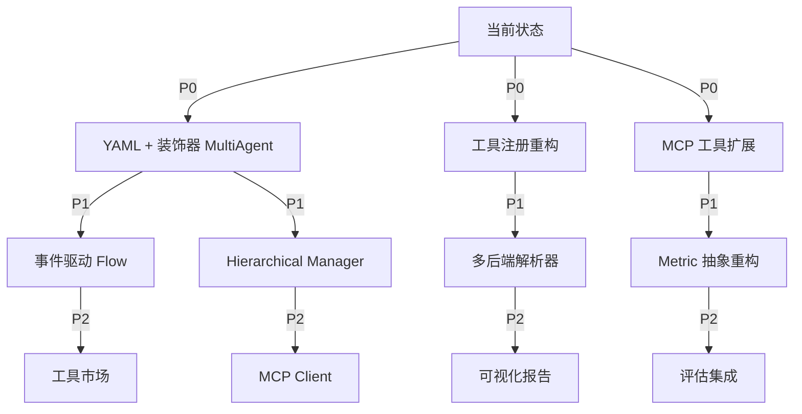

# RagFlow/CrewAI 后端架构深度研究报告

> 研究日期: 2026-05-29 | 研究人: Backend Researcher | 目标: 为 Agent Engine Platform 后端优化提供可借鉴方案

---

## 执行摘要

本报告针对 RagFlow（深度文档解析）和 CrewAI（多Agent协作编排）两大竞品进行深度架构研究，分析其核心引擎设计、技术选型和实现细节。研究发现：

- **RagFlow 文档解析管道**：采用多阶段异步处理流程，支持多种 OCR/TSR/DLR 后端切换
- **CrewAI 编排架构**：基于 YAML 配置 + CrewBase 装饰器的声明式设计，支持 Sequential/Hierarchical/Flow 三种执行模式
- **工具生态设计模式**：LangChain/LlamaIndex 的工具注册机制提供了可借鉴的插件化架构
- **评估引擎实现**：Ragas 的 Metric 抽象 + 执行器模式值得参考
- **MCP 双向协议**：基于 JSON-RPC 2.0 的双向通信设计已成熟

本报告为每个研究点提供了详细分析、架构图描述和可直接应用到 Agent Engine Platform 的具体实现方案。

---

## 研究方法论

### 数据来源
- RagFlow GitHub 仓库源码（主要关注 `deepdoc/` 和 `rag/flow/parser/` 目录）
- CrewAI 官方文档和 GitHub 仓库
- Ragas 论文和源码实现
- MCP 官方规范文档
- LangChain/LlamaIndex 工具生态文档
- Agent Marketplace 架构博客文章

### 分析框架
对于每个研究主题，我们从以下维度进行分析：
1. **架构模式**：核心组件关系和数据流向
2. **技术选型**：关键框架和库的选择原因
3. **可借鉴设计**：可迁移到 Agent Engine Platform 的具体方案
4. **差异化考虑**：结合我们自身优势的改进方向

---

## 一、RagFlow 深度文档解析架构

### 1.1 核心发现：多Parser后端切换架构

RagFlow 从 v0.17.0 开始实现了文档解析任务的解耦设计，将 DeepDoc 特定的数据提取任务从 chunking 方法中分离，实现了多个 OCR/TSR/DLR 后端的灵活切换。

#### 架构设计

```python
# 解析器选择工厂模式
FACTORY = {
    "deepdoc": RAGFlowPdfParser,     # 默认：完整 OCR+TSR+DLR
    "naive": PlainParser,            # 跳过视觉任务（纯文本文档）
    "mineru": MinerUParser,          # 实验性：高性能 PDF 解析
    "docling": DoclingParser,        # 实验性：文档处理工具
    "paddleocr": PaddleOCRParser,    # PaddleOCR VL 算法
    "custom": CustomVLMParser,        # 第三方 VLM 模型
}

# 动态解析器选择
parser = FACTORY[parse_method.lower()]()
```

#### 文档处理管道流程



#### 关键组件分析

**OCR 系统 (`deepdoc/vision/ocr.py`)**
- 基于 ONNX Runtime 的多实例设计
- 支持 CPU + CUDA 多设备并行处理
- DB 文本检测 + CTC 文本识别
- 垃圾文本检测机制

**布局识别 (`deepdoc/vision/layout_recognizer.py`)**
- ONNX/Ascend 双后端支持
- 垃圾布局过滤
- 语义区域分类（标题、段落、表格、图片）

**表格结构识别 (`deepdoc/vision/table_structure.py`)**
- Table Structure Recognition (TSR)
- 支持 HTML 表格输出
- 表格位置信息保留

### 1.2 可借鉴方案

#### 方案 A：多后端解析器架构

适用于 Agent Engine Platform 的 Knowledge 引擎优化。

```python
# backend/knowledge/parsers/base.py
from abc import ABC, abstractmethod
from typing import BinaryIO, Dict, Any, List

class DocumentParser(ABC):
    """文档解析器基类"""
    
    @abstractmethod
    async def parse(
        self, 
        file_binary: bytes,
        config: Dict[str, Any]
    ) -> List[Dict[str, Any]]:
        """
        解析文档为结构化数据块
        
        Returns:
            List of chunks with:
            - text: str
            - metadata: Dict (page_num, bbox, table_data, etc.)
            - doc_type: str
        """
        pass
    
    @abstractmethod
    def supported_formats(self) -> List[str]:
        """支持的文件格式列表"""
        pass

# backend/knowledge/parsers/pdf_factory.py
class PDFParserFactory:
    """PDF 解析器工厂"""
    
    _parsers: Dict[str, Type[DocumentParser]] = {
        "naive": NaivePDFParser,          # 纯文本提取
        "ocr": OCRPDFParser,             # 基础 OCR
        "advanced": AdvancedPDFParser,   # 完整 OCR+TSR+DLR
        "mineru": MinerUAdapter,         # MinerU 集成
        "ragflow": RagFlowAdapter,       # RagFlow API
    }
    
    @classmethod
    def get_parser(
        cls, 
        method: str,
        tenant_id: str,
        config: Dict[str, Any] = None
    ) -> DocumentParser:
        parser_class = cls._parsers.get(method.lower())
        if not parser_class:
            raise ValueError(f"Unknown parser method: {method}")
        
        return parser_class(
            tenant_id=tenant_id,
            config=config or {}
        )
    
    @classmethod
    def register_parser(
        cls,
        name: str,
        parser_class: Type[DocumentParser]
    ):
        """注册自定义解析器（插件扩展点）"""
        cls._parsers[name] = parser_class

# backend/knowledge/parsers/advanced_pdf.py
class AdvancedPDFParser(DocumentParser):
    """
    高级 PDF 解析器
    功能：OCR + 布局识别 + 表格结构识别
    """
    
    def __init__(self, tenant_id: str, config: Dict[str, Any]):
        self.tenant_id = tenant_id
        self.config = config
        
        # 按需初始化 OCR 模型（支持多 GPU）
        self.ocr_engine = self._init_ocr_engine()
        self.layout_recognizer = self._init_layout_recognizer()
        self.table_recognizer = self._init_table_recognizer()
    
    async def parse(
        self, 
        file_binary: bytes,
        config: Dict[str, Any]
    ) -> List[Dict[str, Any]]:
        # 1. 转换 PDF 为图片
        images = await self._pdf_to_images(file_binary)
        
        # 2. 并行 OCR 处理（支持多页）
        ocr_results = await self._run_ocr_batch(images)
        
        # 3. 布局分析
        layout_info = await self._analyze_layout(images, ocr_results)
        
        # 4. 表格结构识别
        tables = await self._recognize_tables(images, layout_info)
        
        # 5. 组装结构化输出
        chunks = self._assemble_chunks(
            ocr_results,
            layout_info,
            tables
        )
        
        return chunks
```

#### 方案 B：异步任务队列处理

RagFlow 使用 Redis Streams + Task Executor 的异步处理模式，值得借鉴。

```python
# backend/knowledge/tasks/document_processing.py
from typing import Optional
import asyncio
from backend.core.redis import redis_streams
from backend.knowledge.parsers.pdf_factory import PDFParserFactory

class DocumentProcessingTask:
    """文档处理任务"""
    
    STREAM_KEY = "doc:processing:queue"
    CONSUMER_GROUP = "doc_processors"
    
    def __init__(
        self,
        task_id: str,
        tenant_id: str,
        document_id: str,
        parse_method: str,
        file_path: str
    ):
        self.task_id = task_id
        self.tenant_id = tenant_id
        self.document_id = document_id
        self.parse_method = parse_method
        self.file_path = file_path
    
    async def execute(self) -> Dict[str, Any]:
        """执行文档处理"""
        try:
            # 1. 读取文件
            file_binary = await self._read_file()
            
            # 2. 选择解析器
            parser = PDFParserFactory.get_parser(
                method=self.parse_method,
                tenant_id=self.tenant_id
            )
            
            # 3. 解析文档
            chunks = await parser.parse(
                file_binary=file_binary,
                config=self._get_parser_config()
            )
            
            # 4. 增强处理（可选 LLM）
            if self._should_enhance():
                chunks = await self._enhance_chunks(chunks)
            
            # 5. 向量化
            embeddings = await self._embed_chunks(chunks)
            
            # 6. 存储到向量库
            await self._store_to_vector_store(chunks, embeddings)
            
            # 7. 更新文档状态
            await self._update_document_status("completed")
            
            return {
                "status": "success",
                "chunks_count": len(chunks),
                "task_id": self.task_id
            }
            
        except Exception as e:
            await self._update_document_status("failed", str(e))
            raise
    
    async def _read_file(self) -> bytes:
        """读取文件二进制"""
        # 实现文件读取逻辑
        pass
    
    def _get_parser_config(self) -> Dict[str, Any]:
        """获取解析器配置（租户级别）"""
        # 从数据库或配置中心获取
        pass

# backend/knowledge/worker.py
import asyncio
from backend.knowledge.tasks.document_processing import DocumentProcessingTask

class DocumentProcessingWorker:
    """文档处理工作器"""
    
    def __init__(self, consumer_id: str):
        self.consumer_id = consumer_id
        self.running = False
    
    async def start(self):
        """启动工作器"""
        self.running = True
        
        while self.running:
            try:
                # 从 Redis Streams 读取任务
                task_data = await redis_streams.xreadgroup(
                    group=DocumentProcessingTask.CONSUMER_GROUP,
                    consumer=self.consumer_id,
                    streams={DocumentProcessingTask.STREAM_KEY: ">"},
                    count=1,
                    block=5000  # 5秒超时
                )
                
                if not task_data:
                    continue
                
                # 处理任务
                for stream, messages in task_data:
                    for message_id, message in messages:
                        task = DocumentProcessingTask(**message)
                        result = await task.execute()
                        
                        # 确认消息处理完成
                        await redis_streams.xack(
                            DocumentProcessingTask.STREAM_KEY,
                            DocumentProcessingTask.CONSUMER_GROUP,
                            message_id
                        )
                        
            except asyncio.CancelledError:
                break
            except Exception as e:
                logger.error(f"Worker error: {e}")
                await asyncio.sleep(1)
    
    async def stop(self):
        """停止工作器"""
        self.running = False

# 启动多个工作器进程
async def main():
    workers = [
        DocumentProcessingWorker(f"worker-{i}")
        for i in range(4)  # 4个并行工作器
    ]
    
    await asyncio.gather(*[w.start() for w in workers])
```

#### 方案 C：解析器配置组件化

借鉴 RagFlow 的 Parser Component 设计，实现可视化配置。

```python
# backend/knowledge/schemas/parser_config.py
from typing import Dict, List, Optional, Literal
from pydantic import BaseModel

class FileParserConfig(BaseModel):
    """文件解析器配置"""
    file_type: Literal["pdf", "xlsx", "docx", "pptx", "image", "audio", "video"]
    parse_method: str
    output_format: Literal["json", "html", "text", "markdown"]
    lang: str = "Chinese"
    
    # PDF 特定配置
    ocr_enabled: bool = True
    layout_analysis: bool = True
    table_extraction: bool = True
    zoomin: int = 3
    
    # 模型选择
    ocr_model: Optional[str] = None  # "mineru", "paddleocr"
    vlm_model: Optional[str] = None   # 用于图片/视频

class ParserComponentConfig(BaseModel):
    """解析器组件配置（对应 Canvas 中的 Parser Component）"""
    parsers: List[FileParserConfig]
    
    def get_parser_for_file(
        self, 
        file_type: str,
        file_extension: str
    ) -> Optional[FileParserConfig]:
        """根据文件类型获取配置"""
        for parser in self.parsers:
            if parser.file_type == file_type:
                return parser
        return None

# backend/api/v1/knowledge/config.py
@router.post("/knowledge/datasets/{dataset_id}/parser-config")
async def update_parser_config(
    dataset_id: str,
    config: ParserComponentConfig,
    current_user: User = Depends(get_current_user)
):
    """更新知识库的解析器配置"""
    # 保存到数据集配置
    await dataset_service.update_parser_config(
        dataset_id=dataset_id,
        tenant_id=current_user.tenant_id,
        config=config.dict()
    )
    return {"status": "success"}
```

### 1.3 差异化优势

结合 Agent Engine Platform 现有优势：

1. **安全引擎集成**：在解析过程中自动检测和脱敏 PII 信息
2. **多租户隔离**：解析器配置和模型选择按租户隔离
3. **评估驱动优化**：通过评估结果反馈自动选择最佳解析方法

```python
class SecureDocumentParser(DocumentParser):
    """安全文档解析器（集成 Safety 引擎）"""
    
    def __init__(self, tenant_id: str, config: Dict[str, Any]):
        super().__init__(tenant_id, config)
        from backend.engines.safety.detector import PIIDetector
        self.pii_detector = PIIDetector(tenant_id)
    
    async def parse(
        self, 
        file_binary: bytes,
        config: Dict[str, Any]
    ) -> List[Dict[str, Any]]:
        chunks = await super().parse(file_binary, config)
        
        # PII 脱敏
        for chunk in chunks:
            chunk["text"] = self.pii_detector.redact(chunk["text"])
            chunk["pii_detected"] = self.pii_detector.get_detected_types(chunk["text"])
        
        return chunks
```

---

## 二、CrewAI 多Agent协作编排模式

### 2.1 核心发现：YAML配置 + CrewBase装饰器模式

CrewAI 采用声明式配置 + 装饰器自动收集的设计模式，极大地简化了多Agent系统的定义和管理。

#### 架构层次

```
┌─────────────────────────────────────────────────────┐
│              YAML Configuration Layer               │
│  (agents.yaml + tasks.yaml)                        │
│  - 角色定义 (role/goal/backstory)                  │
│  - 任务定义 (description/expected_output/agent)      │
│  - 变量插值 ({topic}, {user_input})                │
└─────────────────────────────────────────────────────┘
                          ↓
┌─────────────────────────────────────────────────────┐
│               CrewBase Class Layer                  │
│  @agent, @task, @crew decorators                   │
│  - 自动收集 agents 和 tasks                        │
│  - 替换 YAML 变量                                  │
│  - 提供 @before_kickoff/@after_kickoff hooks       │
└─────────────────────────────────────────────────────┘
                          ↓
┌─────────────────────────────────────────────────────┐
│               Process Execution Layer               │
│  Sequential / Hierarchical / Flows                 │
│  - 任务编排逻辑                                    │
│  - Agent 间通信                                     │
│  - 结果聚合                                        │
└─────────────────────────────────────────────────────┘
```

#### YAML 配置示例

```yaml
# config/agents.yaml
researcher:
  role: >
    {topic} Senior Data Researcher
  goal: >
    Uncover cutting-edge developments in {topic}
  backstory: >
    You're a seasoned researcher with a knack for uncovering the latest
    developments in {topic}. Known for your ability to find the most relevant
    information and present it in a clear and concise manner.
  verbose: true
  tools:
    - serper_dev_tool
    - file_read_tool
  llm: "gpt-4o"

reporting_analyst:
  role: >
    {topic} Reporting Analyst
  goal: >
    Create detailed reports based on {topic} data analysis and research findings
  backstory: >
    You're a meticulous analyst with a keen eye for detail. You're known for
    your ability to turn complex data into clear and concise reports.
  verbose: true
  llm: "gpt-4o-mini"

# config/tasks.yaml
research_task:
  description: >
    Conduct a thorough research about {topic}
    Make sure you find any interesting and relevant information given
    the current year is 2025.
  expected_output: >
    A list with 10 bullet points of the most relevant information about {topic}
  agent: researcher
  async_execution: false

reporting_task:
  description: >
    Review the context you got and expand each topic into a full section for a report.
    Make sure the report is detailed and contains any and all relevant information.
  expected_output: >
    A fully fledge reports with the mains topics, each with a full section of information.
    Formatted as markdown without '```'
  agent: reporting_analyst
  context:
    - research_task
  output_file: report.md
```

#### CrewBase 装饰器实现

```python
# crew.py
from crewai import Crew, Agent, Task, Process
from crewai.project import CrewBase, agent, crew, task, before_kickoff, after_kickoff

@CrewBase
class LatestAiDevelopmentCrew:
    """LatestAiDevelopment crew"""
    
    agents_config = 'config/agents.yaml'
    tasks_config = 'config/tasks.yaml'
    
    @before_kickoff
    def before_kickoff_func(self, inputs: Dict[str, Any]):
        """在工作流开始前执行"""
        logger.info(f"Starting crew with inputs: {inputs}")
        # 可以在这里添加初始化逻辑
        
        return inputs
    
    @agent
    def researcher(self) -> Agent:
        return Agent(
            config=self.agents_config['researcher'],
            verbose=True
        )
    
    @agent
    def reporting_analyst(self) -> Agent:
        return Agent(
            config=self.agents_config['reporting_analyst'],
            verbose=True
        )
    
    @task
    def research_task(self) -> Task:
        return Task(
            config=self.tasks_config['research_task']
        )
    
    @task
    def reporting_task(self) -> Task:
        return Task(
            config=self.tasks_config['reporting_task']
        )
    
    @crew
    def crew(self) -> Crew:
        return Crew(
            agents=self.agents,
            tasks=self.tasks,
            process=Process.sequential,
            verbose=True,
            memory=True
        )
    
    @after_kickoff
    def after_kickoff_func(self, result):
        """在工作流完成后执行"""
        logger.info(f"Crew finished with result: {result}")
        # 可以在这里添加结果后处理
        
        return result

# 执行
crew = LatestAiDevelopmentCrew()
result = crew.crew().kickoff(inputs={"topic": "AI in 2025"})
```

### 2.2 Process 执行模式

#### Sequential Process

```python
crew = Crew(
    agents=[agent1, agent2],
    tasks=[task1, task2],
    process=Process.sequential
)

# 执行流程：
# task1 (agent1) → task1_result → task2 (agent2 + task1_result) → final_result
```

#### Hierarchical Process

```python
crew = Crew(
    agents=[agent1, agent2, agent3],
    tasks=[task1, task2, task3],
    process=Process.hierarchical,
    manager_llm="gpt-4o"  # 或 manager_agent=custom_manager
)

# 执行流程：
# manager 分配任务 → 验证结果 → 重新分配或继续 → 最终输出
```

#### CrewAI Flows（事件驱动工作流）

```python
from crewai.flow import Flow, listen, start, router

class LeadScoreFlow(Flow):
    
    @start()
    def fetch_leads(self):
        """获取销售线索"""
        leads = leads_service.get_recent_leads(limit=10)
        return leads
    
    @listen(fetch_leads)
    def score_leads(self, leads):
        """对线索进行评分"""
        scored_leads = []
        for lead in leads:
            score = lead_scoring_model.score(lead)
            scored_leads.append({"lead": lead, "score": score})
        return scored_leads
    
    @router(score_leads)
    def route_by_score(self, scored_leads):
        """根据分数路由"""
        for item in scored_leads:
            if item["score"] > 80:
                self.send_to("high_score_handler", item)
            elif item["score"] > 50:
                self.send_to("medium_score_handler", item)
            else:
                self.send_to("low_score_handler", item)
    
    @listen(high_score_handler)
    def handle_high_score(self, item):
        """处理高分线索"""
        return f"High priority: {item['lead']['name']}"

# 执行
flow = LeadScoreFlow()
result = flow.kickoff()
```

### 2.3 可借鉴方案

#### 方案 A：YAML 配置 + 装饰器模式

适用于 Agent Engine Platform 的 MultiAgent 引擎优化。

```python
# backend/engines/multi_agent/crew_base.py
from typing import Dict, Any, List, Optional, Callable
from abc import ABC, abstractmethod
import yaml
from pathlib import Path

class CrewBase(ABC):
    """Crew 基类（YAML配置驱动）"""
    
    agents_config: str = "config/agents.yaml"
    tasks_config: str = "config/tasks.yaml"
    
    def __init__(self):
        self._agents_cache: Dict[str, Any] = {}
        self._tasks_cache: Dict[str, Any] = {}
        self._crew_instance: Optional[Any] = None
        
        # 加载 YAML 配置
        self._load_configs()
    
    def _load_configs(self):
        """加载 YAML 配置文件"""
        agents_path = Path(__file__).parent / self.agents_config
        tasks_path = Path(self.file).parent / self.tasks_config
        
        with open(agents_path) as f:
            self._agents_config_data = yaml.safe_load(f)
        
        with open(tasks_path) as f:
            self._tasks_config_data = yaml.safe_load(f)
    
    def get_agent_config(self, agent_name: str) -> Dict[str, Any]:
        """获取 Agent 配置"""
        return self._agents_config_data.get(agent_name, {})
    
    def get_task_config(self, task_name: str) -> Dict[str, Any]:
        """获取 Task 配置"""
        return self._tasks_config_data.get(task_name, {})
    
    @abstractmethod
    def crew(self):
        """定义 Crew 实例（子类实现）"""
        pass
    
    def before_kickoff(self, inputs: Dict[str, Any]) -> Dict[str, Any]:
        """执行前 Hook"""
        return inputs
    
    def after_kickoff(self, result) -> Any:
        """执行后 Hook"""
        return result
    
    def kickoff(self, inputs: Optional[Dict[str, Any]] = None):
        """启动执行"""
        inputs = inputs or {}
        
        # 执行前 Hook
        inputs = self.before_kickoff(inputs)
        
        # 替换 YAML 变量
        resolved_inputs = self._resolve_variables(inputs)
        
        # 执行 Crew
        crew = self.crew()
        result = crew.run(inputs=resolved_inputs)
        
        # 执行后 Hook
        result = self.after_kickoff(result)
        
        return result
    
    def _resolve_variables(self, inputs: Dict[str, Any]) -> Dict[str, Any]:
        """解析 YAML 中的变量"""
        # 实现变量替换逻辑
        pass

# backend/engines/multi_agent/decorators.py
def agent(cls):
    """Agent 装饰器（自动收集到 Crew）"""
    cls._is_agent = True
    return cls

def task(cls):
    """Task 装饰器（自动收集到 Crew）"""
    cls._is_task = True
    return cls

def crew(cls):
    """Crew 装饰器（自动收集 agents 和 tasks）"""
    original_init = cls.__init__
    
    def __init__(self, *args, **kwargs):
        original_init(self, *args, **kwargs)
        
        # 自动收集 agents
        self.agents = []
        for name, value in self.__class__.__dict__.items():
            if hasattr(value, '_is_agent'):
                self.agents.append(getattr(self, name)())
        
        # 自动收集 tasks
        self.tasks = []
        for name, value in self.__class__.__dict__.items():
            if hasattr(value, '_is_task'):
                self.tasks.append(getattr(self, name)())
    
    cls.__init__ = __init__
    return cls

# 使用示例
@CrewBase
class DataAnalysisCrew:
    """数据分析 Crew"""
    
    agents_config = "config/agents.yaml"
    tasks_config = "config/tasks.yaml"
    
    @agent
    def data_engineer(self) -> Agent:
        return Agent(
            config=self.agents_config['data_engineer']
        )
    
    @agent
    def analyst(self) -> Agent:
        return Agent(
            config=self.agents_config['analyst']
        )
    
    @task
    def extraction_task(self) -> Task:
        return Task(
            config=self.tasks_config['extraction_task']
        )
    
    @task
    def analysis_task(self) -> Task:
        return Task(
            config=self.tasks_config['analysis_task']
        )
    
    @crew
    def crew(self) -> Crew:
        return Crew(
            agents=self.agents,
            tasks=self.tasks,
            process=Process.sequential
        )
```

#### 方案 B：事件驱动 Flow 系统

适用于复杂的多阶段工作流编排。

```python
# backend/engines/multi_agent/flow.py
from typing import Any, Callable, Dict, List, Optional, Union
from abc import ABC, abstractmethod
from enum import Enum
import asyncio

class FlowEventType(Enum):
    """Flow 事件类型"""
    START = "start"
    LISTEN = "listen"
    ROUTER = "router"
    END = "end"

class FlowEvent:
    """Flow 事件"""
    def __init__(
        self,
        type: FlowEventType,
        handler: Callable,
        listeners: Optional[List[str]] = None,
        condition: Optional[Callable[[Any], bool]] = None
    ):
        self.type = type
        self.handler = handler
        self.listeners = listeners  # 监听的事件名称
        self.condition = condition  # 路由条件

class Flow:
    """事件驱动 Flow 基类"""
    
    def __init__(self):
        self._events: Dict[str, FlowEvent] = {}
        self._state: Dict[str, Any] = {}
        self._execution_id: Optional[str] = None
    
    def start(self, func: Callable):
        """@start 装饰器"""
        self._register_event(
            name=func.__name__,
            type=FlowEventType.START,
            handler=func
        )
        return func
    
    def listen(self, *event_names: str):
        """@listen 装饰器"""
        def decorator(func: Callable):
            self._register_event(
                name=func.__name__,
                type=FlowEventType.LISTEN,
                handler=func,
                listeners=list(event_names)
            )
            return func
        return decorator
    
    def router(self, event_name: str):
        """@router 装饰器"""
        def decorator(func: Callable):
            self._register_event(
                name=func.__name__,
                type=FlowEventType.ROUTER,
                handler=func,
                listeners=[event_name]
            )
            return func
        return decorator
    
    def _register_event(
        self,
        name: str,
        type: FlowEventType,
        handler: Callable,
        listeners: Optional[List[str]] = None,
        condition: Optional[Callable[[Any], bool]] = None
    ):
        """注册事件"""
        self._events[name] = FlowEvent(
            type=type,
            handler=handler,
            listeners=listeners,
            condition=condition
        )
    
    async def kickoff(self, inputs: Optional[Dict[str, Any]] = None):
        """启动 Flow 执行"""
        self._execution_id = str(uuid.uuid4())
        self._state = inputs or {}
        
        # 查找所有 start 事件
        start_events = [
            (name, event)
            for name, event in self._events.items()
            if event.type == FlowEventType.START
        ]
        
        # 并行执行所有 start 事件
        results = await asyncio.gather(*[
            self._execute_event(name, event)
            for name, event in start_events
        ])
        
        return self._aggregate_results(results)
    
    async def _execute_event(
        self,
        name: str,
        event: FlowEvent,
        input_data: Optional[Any] = None
    ) -> Any:
        """执行单个事件"""
        try:
            if asyncio.iscoroutinefunction(event.handler):
                result = await event.handler(self, input_data)
            else:
                result = event.handler(self, input_data)
            
            # 保存结果到状态
            self._state[name] = result
            
            # 触发监听此事件的其他事件
            await self._trigger_listeners(name, result)
            
            return result
        except Exception as e:
            logger.error(f"Event {name} failed: {e}")
            raise
    
    async def _trigger_listeners(self, event_name: str, result: Any):
        """触发监听指定事件的事件"""
        for listener_name, event in self._events.items():
            if event.listeners and event_name in event.listeners:
                # 检查路由条件（如果有）
                if event.condition and not event.condition(result):
                    continue
                
                await self._execute_event(listener_name, event, result)
    
    def send_to(self, event_name: str, data: Any):
        """手动发送数据到指定事件"""
        asyncio.create_task(
            self._execute_event(event_name, self._events[event_name], data)
        )
    
    def _aggregate_results(self, results: List[Any]) -> Any:
        """聚合最终结果"""
        # 实现结果聚合逻辑
        pass

# 使用示例
class DocumentProcessingFlow(Flow):
    """文档处理 Flow"""
    
    @start
    async def fetch_documents(self):
        """获取待处理文档"""
        docs = await document_service.get_pending_documents()
        return docs
    
    @listen(fetch_documents)
    async def parse_documents(self, docs):
        """解析文档"""
        parsed = []
        for doc in docs:
            result = await parser.parse(doc)
            parsed.append(result)
        return parsed
    
    @listen(parse_documents)
    async def embed_chunks(self, parsed_docs):
        """向量化文档块"""
        embeddings = await embedding_service.embed_batch(
            [chunk for doc in parsed_docs for chunk in doc['chunks']]
        )
        return embeddings
    
    @router(embed_chunks)
    def route_by_quality(self, embeddings):
        """根据质量路由"""
        avg_quality = sum(e['quality'] for e in embeddings) / len(embeddings)
        
        if avg_quality > 0.8:
            self.send_to('high_quality_handler', embeddings)
        else:
            self.send_to('reprocess_handler', embeddings)
    
    @listen(high_quality_handler)
    async def store_to_vector_db(self, embeddings):
        """存储到向量数据库"""
        await vector_store.insert(embeddings)
        return {"status": "stored", "count": len(embeddings)}
    
    @listen(reprocess_handler)
    async def reprocess_documents(self, embeddings):
        """重新处理低质量文档"""
        # 实现重新处理逻辑
        pass

# 执行
flow = DocumentProcessingFlow()
result = await flow.kickoff()
```

#### 方案 C：Hierarchical Process Manager Agent

```python
# backend/engines/multi_agent/hierarchical.py
from typing import List, Dict, Any, Optional
from pydantic import BaseModel

class TaskDelegation(BaseModel):
    """任务委派"""
    task_id: str
    agent_id: str
    input_data: Dict[str, Any]
    priority: int = 0
    dependencies: List[str] = []

class ManagerAgent:
    """Manager Agent（Hierarchical Process）"""
    
    def __init__(
        self,
        manager_llm: str,
        agents: List[Agent],
        tasks: List[Task]
    ):
        self.manager_llm = manager_llm
        self.agents = agents  # {agent_id: Agent}
        self.tasks = tasks    # {task_id: Task}
        self.execution_log: List[Dict[str, Any]] = []
    
    async def execute(self, inputs: Dict[str, Any]) -> Any:
        """执行 Hierarchical Process"""
        
        # 1. Manager 分析任务并制定计划
        plan = await self._create_execution_plan(inputs)
        
        # 2. 根据计划委派任务
        delegations = plan.delegations
        
        # 3. 执行任务（并行执行无依赖的任务）
        results = {}
        completed_tasks = set()
        
        while len(completed_tasks) < len(delegations):
            # 找出可执行的任务（所有依赖已完成）
            ready_tasks = [
                d for d in delegations
                if all(dep in completed_tasks for dep in d.dependencies)
            ]
            
            # 并行执行
            task_results = await asyncio.gather(*[
                self._execute_delegation(d)
                for d in ready_tasks
            ])
            
            # 记录结果
            for delegation, result in zip(ready_tasks, task_results):
                results[delegation.task_id] = result
                completed_tasks.add(delegation.task_id)
                
                # Manager 验证结果
                validation = await self._validate_result(
                    task_id=delegation.task_id,
                    result=result
                )
                
                if not validation.passed:
                    # 根据验证结果调整策略
                    adjustment = await self._adjust_strategy(validation)
                    if adjustment.retry:
                        # 重新执行
                        completed_tasks.remove(delegation.task_id)
        
        # 4. 最终聚合
        final_result = await self._aggregate_results(results)
        return final_result
    
    async def _create_execution_plan(self, inputs: Dict[str, Any]) -> ExecutionPlan:
        """Manager 创建执行计划"""
        
        # 构造 Manager 的 Prompt
        prompt = f"""
        You are a project manager coordinating a team of agents.
        
        Available Agents:
        {self._format_agents()}
        
        Available Tasks:
        {self._format_tasks()}
        
        User Request:
        {inputs}
        
        Create an execution plan that:
        1. Assigns each task to the most suitable agent
        2. Determines task dependencies
        3. Sets priorities for parallel execution
        """
        
        response = await llm_service.generate(
            model=self.manager_llm,
            messages=[{"role": "user", "content": prompt}],
            response_format=ExecutionPlan
        )
        
        return ExecutionPlan(**response)
    
    async def _validate_result(
        self,
        task_id: str,
        result: Any
    ) -> ValidationResult:
        """Manager 验证任务结果"""
        
        prompt = f"""
        You are a project manager validating task results.
        
        Task: {self.tasks[task_id].description}
        Expected Output: {self.tasks[task_id].expected_output}
        
        Actual Result:
        {result}
        
        Evaluate:
        1. Does the result meet the expected output?
        2. Is the quality acceptable?
        3. Does it need rework?
        """
        
        response = await llm_service.generate(
            model=self.manager_llm,
            messages=[{"role": "user", "content": prompt}],
            response_format=ValidationResult
        )
        
        return ValidationResult(**response)
    
    async def _adjust_strategy(
        self,
        validation: ValidationResult
    ) -> StrategyAdjustment:
        """根据验证结果调整策略"""
        
        if validation.confidence < 0.5:
            # 低置信度：重新执行
            return StrategyAdjustment(
                retry=True,
                new_agent_id=None,
                feedback=validation.feedback
            )
        elif validation.suggested_improvements:
            # 有改进建议：传递反馈重新执行
            return StrategyAdjustment(
                retry=True,
                feedback="\n".join(validation.suggested_improvements)
            )
        else:
            # 不需要重试
            return StrategyAdjustment(retry=False)

# 数据模型
class ExecutionPlan(BaseModel):
    """执行计划"""
    delegations: List[TaskDelegation]
    estimated_duration: Optional[int] = None
    risk_factors: Optional[List[str]] = None

class ValidationResult(BaseModel):
    """验证结果"""
    passed: bool
    confidence: float
    feedback: Optional[str] = None
    suggested_improvements: Optional[List[str]] = None

class StrategyAdjustment(BaseModel):
    """策略调整"""
    retry: bool
    new_agent_id: Optional[str] = None
    feedback: Optional[str] = None
```

### 2.4 差异化优势

结合 Agent Engine Platform 现有优势：

1. **安全引擎集成**：在 Manager Agent 验证结果时进行安全检查
2. **评估引擎集成**：实时评估 Agent 输出质量
3. **记忆系统集成**：跨 Crew 共享长期记忆

```python
class SecureManagerAgent(ManagerAgent):
    """安全的 Manager Agent"""
    
    def __init__(
        self,
        manager_llm: str,
        agents: List[Agent],
        tasks: List[Task],
        tenant_id: str
    ):
        super().__init__(manager_llm, agents, tasks)
        self.tenant_id = tenant_id
        
        from backend.engines.safety.detector import PromptInjectionDetector
        from backend.engines.safety.pii import PIIDetector
        
        self.injection_detector = PromptInjectionDetector(tenant_id)
        self.pii_detector = PIIDetector(tenant_id)
    
    async def _validate_result(
        self,
        task_id: str,
        result: Any
    ) -> ValidationResult:
        """验证任务结果（带安全检查）"""
        
        # 1. 基础验证
        validation = await super()._validate_result(task_id, result)
        
        # 2. 安全检查
        if isinstance(result, str):
            # 检查 Prompt 注入
            if self.injection_detector.detect(result):
                validation.passed = False
                validation.feedback = "Potential prompt injection detected"
            
            # 检查 PII 泄露
            pii_types = self.pii_detector.get_detected_types(result)
            if pii_types:
                validation.passed = False
                validation.feedback = f"PII detected: {', '.join(pii_types)}"
        
        return validation
```

---

## 三、工具注册与市场架构设计

### 3.1 核心发现：LangChain/LlamaIndex 工具生态模式

#### LangChain 工具架构

```python
# LangChain 工具定义模式
from langchain_core.tools import tool

@tool
def multiply(a: int, b: int) -> int:
    """Multiplies two numbers together."""
    return a * b

# 或使用类方式
from langchain_core.tools import BaseTool

class CustomTool(BaseTool):
    name = "custom_tool"
    description = "This is a custom tool"
    
    def _run(self, query: str) -> str:
        return f"Result for: {query}"
    
    async def _arun(self, query: str) -> str:
        return f"Async result for: {query}"
```

#### LlamaIndex 工具架构

```python
# LlamaIndex 工具定义模式
from llama_index.core.tools import FunctionTool

def multiply(a: int, b: int) -> int:
    """Multiplies two numbers."""
    return a * b

multiply_tool = FunctionTool.from_defaults(multiply)

# 或使用 ToolSpec
from llama_index.core.tools.tool_spec.base import BaseToolSpec

class GmailToolSpec(BaseToolSpec):
    spec_functions = ["send_email", "read_email", "search_emails"]
    
    async def send_email(self, to: str, subject: str, body: str) -> str:
        """Send an email"""
        # 实现
        pass
```

### 3.2 Agent Marketplace 架构模式

#### 核心组件

```
┌─────────────────────────────────────────────────────┐
│                   API Gateway                       │
│  (认证 / 限流 / 路由 / 版本管理)                     │
└─────────────────────────────────────────────────────┘
                          ↓
┌─────────────────────────────────────────────────────┐
│                Service Registry                     │
│  (工具注册 / 发现 / 元数据管理)                      │
└─────────────────────────────────────────────────────┘
                          ↓
┌─────────────────────────────────────────────────────┐
│              Execution Engine                       │
│  (沙箱管理 / 资源限制 / 超时控制)                   │
└─────────────────────────────────────────────────────┘
                          ↓
┌─────────────────────────────────────────────────────┐
│              Tool Proxy Layer                        │
│  (凭证注入 / 请求过滤 / 使用计量)                    │
└─────────────────────────────────────────────────────┘
```

#### 数据模型

```python
from pydantic import BaseModel
from typing import List, Optional, Dict, Any
from enum import Enum

class ToolCategory(str, Enum):
    """工具分类"""
    DATA = "data"
    PRODUCTIVITY = "productivity"
    INTEGRATION = "integration"
    AI_ML = "ai_ml"
    SECURITY = "security"
    MONITORING = "monitoring"

class ToolPricingModel(str, Enum):
    """定价模型"""
    FREE = "free"
    PER_CALL = "per_call"
    SUBSCRIPTION = "subscription"

class ToolListing(BaseModel):
    """工具列表项"""
    id: str
    publisher_id: str
    name: str
    slug: str
    description: str
    long_description: Optional[str] = None
    
    # 版本信息
    version: str = "1.0.0"
    
    # 分类和标签
    category: ToolCategory
    tags: List[str] = []
    
    # 状态
    status: str = "draft"  # draft, published, archived
    
    # 定价
    pricing_model: ToolPricingModel = ToolPricingModel.FREE
    price_per_call: Optional[float] = None
    monthly_price: Optional[float] = None
    
    # 技术要求
    required_credentials: List[str] = []
    required_permissions: List[str] = []
    
    # 使用统计
    install_count: int = 0
    avg_rating: float = 0.0
    total_ratings: int = 0
    
    # 部署配置
    deployment_config: Dict[str, Any] = {}
    
    # 元数据
    created_at: str
    updated_at: str

class ToolExecution(BaseModel):
    """工具执行记录"""
    id: str
    tool_id: str
    tenant_id: str
    agent_id: Optional[str] = None
    
    # 执行信息
    input_data: Dict[str, Any]
    output_data: Optional[Dict[str, Any]] = None
    status: str  # pending, running, completed, failed
    
    # 计量
    duration_ms: Optional[int] = None
    token_usage: Optional[int] = None
    cost_usd: Optional[float] = None
    
    # 错误信息
    error_message: Optional[str] = None
    
    created_at: str
    completed_at: Optional[str] = None
```

### 3.3 可借鉴方案

#### 方案 A：工具注册与发现系统

```python
# backend/tools/registry.py
from typing import Dict, List, Optional, Type, Callable, Any
from abc import ABC, abstractmethod
import importlib
import pkgutil

class Tool(ABC):
    """工具基类"""
    
    name: str = ""
    description: str = ""
    version: str = "1.0.0"
    category: ToolCategory = ToolCategory.OTHER
    author: str = ""
    
    @abstractmethod
    async def execute(self, **kwargs) -> Any:
        """执行工具"""
        pass
    
    @abstractmethod
    def get_schema(self) -> Dict[str, Any]:
        """获取工具 Schema（用于 LLM）"""
        pass
    
    def get_metadata(self) -> Dict[str, Any]:
        """获取工具元数据"""
        return {
            "name": self.name,
            "description": self.description,
            "version": self.version,
            "category": self.category.value,
            "author": self.author,
            "schema": self.get_schema()
        }

class ToolRegistry:
    """工具注册表"""
    
    _tools: Dict[str, Type[Tool]] = {}
    _instances: Dict[str, Tool] = {}
    
    @classmethod
    def register(cls, tool_class: Type[Tool]):
        """注册工具类"""
        tool_name = tool_class.name or tool_class.__name__.lower()
        cls._tools[tool_name] = tool_class
        return tool_class
    
    @classmethod
    def get_tool(cls, name: str, config: Dict[str, Any] = None) -> Tool:
        """获取工具实例"""
        if name not in cls._tools:
            raise ValueError(f"Tool not found: {name}")
        
        if name not in cls._instances:
            tool_class = cls._tools[name]
            cls._instances[name] = tool_class(config or {})
        
        return cls._instances[name]
    
    @classmethod
    def list_tools(
        cls,
        category: Optional[ToolCategory] = None,
        tenant_id: Optional[str] = None
    ) -> List[Dict[str, Any]]:
        """列出可用工具"""
        tools = []
        
        for name, tool_class in cls._tools.items():
            # 类别过滤
            if category and tool_class.category != category:
                continue
            
            # 租户权限过滤
            if tenant_id and not cls._check_permission(tenant_id, name):
                continue
            
            tools.append(tool_class({}).get_metadata())
        
        return tools
    
    @classmethod
    def discover_tools(cls, package_path: str):
        """自动发现工具（从指定包）"""
        for _, name, _ in pkgutil.iter_modules([package_path]):
            try:
                module = importlib.import_module(f"{package_path}.{name}")
                for attr_name in dir(module):
                    attr = getattr(module, attr_name)
                    if isinstance(attr, type) and issubclass(attr, Tool) and attr != Tool:
                        cls.register(attr)
            except Exception as e:
                logger.warning(f"Failed to load tool {name}: {e}")
    
    @classmethod
    def _check_permission(cls, tenant_id: str, tool_name: str) -> bool:
        """检查租户是否有权限使用工具"""
        # 实现权限检查逻辑
        pass

# 装饰器注册方式
def register_tool(
    name: str,
    description: str,
    category: ToolCategory = ToolCategory.OTHER,
    version: str = "1.0.0"
):
    """工具注册装饰器"""
    def decorator(cls: Type[Tool]):
        cls.name = name
        cls.description = description
        cls.category = category
        cls.version = version
        return ToolRegistry.register(cls)
    return decorator

# 使用示例
@register_tool(
    name="web_search",
    description="Search the web for information",
    category=ToolCategory.PRODUCTIVITY
)
class WebSearchTool(Tool):
    """Web 搜索工具"""
    
    def __init__(self, config: Dict[str, Any]):
        self.api_key = config.get("api_key")
        self.max_results = config.get("max_results", 10)
    
    async def execute(self, query: str, num_results: int = None) -> List[Dict[str, Any]]:
        """执行搜索"""
        # 实现搜索逻辑
        pass
    
    def get_schema(self) -> Dict[str, Any]:
        """获取 Schema"""
        return {
            "type": "function",
            "function": {
                "name": self.name,
                "description": self.description,
                "parameters": {
                    "type": "object",
                    "properties": {
                        "query": {
                            "type": "string",
                            "description": "Search query"
                        },
                        "num_results": {
                            "type": "integer",
                            "description": "Number of results to return"
                        }
                    },
                    "required": ["query"]
                }
            }
        }
```

#### 方案 B：工具市场 API

```python
# backend/api/v1/tools/marketplace.py
from fastapi import APIRouter, Depends, HTTPException
from typing import List, Optional
from backend.core.auth import get_current_user
from backend.core.rbac import require_permission
from backend.tools.schemas import ToolListing, ToolInstallation

router = APIRouter(prefix="/marketplace", tags=["Tool Marketplace"])

@router.get("/tools")
async def list_marketplace_tools(
    category: Optional[ToolCategory] = None,
    search: Optional[str] = None,
    sort_by: str = "popular",
    current_user: User = Depends(get_current_user)
):
    """浏览工具市场"""
    tools = await marketplace_service.list_tools(
        tenant_id=current_user.tenant_id,
        category=category,
        search=search,
        sort_by=sort_by
    )
    return {"tools": tools}

@router.get("/tools/{tool_id}")
async def get_tool_details(
    tool_id: str,
    current_user: User = Depends(get_current_user)
):
    """获取工具详情"""
    tool = await marketplace_service.get_tool(tool_id)
    
    # 检查是否已安装
    is_installed = await tool_service.is_installed(
        tool_id=tool_id,
        tenant_id=current_user.tenant_id
    )
    
    return {
        **tool.dict(),
        "is_installed": is_installed
    }

@router.post("/tools/{tool_id}/install")
async def install_tool(
    tool_id: str,
    config: ToolInstallation,
    current_user: User = Depends(get_current_user)
):
    """安装工具"""
    # 检查权限
    if not await rbac_service.check_permission(
        user=current_user,
        resource="tools",
        action="install"
    ):
        raise HTTPException(403, "Permission denied")
    
    # 安装工具
    result = await marketplace_service.install_tool(
        tool_id=tool_id,
        tenant_id=current_user.tenant_id,
        credentials=config.credentials,
        config=config.config
    )
    
    return result

@router.get("/installed")
async def list_installed_tools(
    current_user: User = Depends(get_current_user)
):
    """列出已安装工具"""
    tools = await tool_service.list_installed_tools(
        tenant_id=current_user.tenant_id
    )
    return {"tools": tools}

@router.delete("/installed/{tool_id}")
async def uninstall_tool(
    tool_id: str,
    current_user: User = Depends(get_current_user)
):
    """卸载工具"""
    await tool_service.uninstall_tool(
        tool_id=tool_id,
        tenant_id=current_user.tenant_id
    )
    return {"status": "success"}

@router.get("/installed/{tool_id}/usage")
async def get_tool_usage_stats(
    tool_id: str,
    start_date: str,
    end_date: str,
    current_user: User = Depends(get_current_user)
):
    """获取工具使用统计"""
    stats = await analytics_service.get_tool_usage(
        tool_id=tool_id,
        tenant_id=current_user.tenant_id,
        start_date=start_date,
        end_date=end_date
    )
    return stats
```

#### 方案 C：工具执行沙箱

```python
# backend/tools/execution/sandbox.py
import asyncio
from typing import Dict, Any, Optional
import docker
import resource
import signal

class ToolExecutionSandbox:
    """工具执行沙箱"""
    
    def __init__(self, tenant_id: str):
        self.tenant_id = tenant_id
        self.docker_client = docker.from_env()
        self.container_timeout = 30  # 秒
        self.memory_limit = "256m"
        self.cpu_limit = 0.5
    
    async def execute_tool(
        self,
        tool_id: str,
        input_data: Dict[str, Any],
        credentials: Dict[str, Any]
    ) -> Dict[str, Any]:
        """在沙箱中执行工具"""
        
        # 1. 创建临时容器
        container = await self._create_container(tool_id)
        
        try:
            # 2. 注入凭证
            await self._inject_credentials(container, credentials)
            
            # 3. 执行工具
            result = await self._execute_with_timeout(
                container,
                input_data
            )
            
            # 4. 清理容器
            await self._cleanup_container(container)
            
            return result
            
        except asyncio.TimeoutError:
            await self._cleanup_container(container)
            raise TimeoutError(f"Tool execution timed out after {self.container_timeout}s")
        except Exception as e:
            await self._cleanup_container(container)
            raise
    
    async def _create_container(self, tool_id: str):
        """创建执行容器"""
        tool = await tool_service.get_tool(tool_id)
        
        container = self.docker_client.containers.run(
            image=tool.deployment_config.get("image", "python:3.11-slim"),
            command=tool.deployment_config.get("command"),
            detach=True,
            mem_limit=self.memory_limit,
            cpu_quota=int(self.cpu_limit * 100000),
            # 网络隔离
            network_disabled=not tool.deployment_config.get("network_enabled", False),
            # 只允许出站访问白名单
            dns_servers=["8.8.8.8"],
        )
        
        return container
    
    async def _inject_credentials(
        self,
        container,
        credentials: Dict[str, Any]
    ):
        """注入凭证（环境变量）"""
        for key, value in credentials.items():
            # 不写入日志
            container.exec_run(f"export {key}='{value}'")
    
    async def _execute_with_timeout(
        self,
        container,
        input_data: Dict[str, Any]
    ) -> Dict[str, Any]:
        """带超时执行"""
        
        # 创建超时任务
        execution_task = asyncio.create_task(
            self._execute_in_container(container, input_data)
        )
        
        # 等待结果或超时
        result = await asyncio.wait_for(
            execution_task,
            timeout=self.container_timeout
        )
        
        return result
    
    async def _execute_in_container(
        self,
        container,
        input_data: Dict[str, Any]
    ) -> Dict[str, Any]:
        """在容器内实际执行"""
        
        # 通过 stdin 传递输入
        exit_code, output = container.exec_run(
            cmd=f"python -c 'import sys; import json; print(json.dumps({input_data}))'",
            stdin_open=True
        )
        
        if exit_code != 0:
            raise RuntimeError(f"Tool execution failed: {output}")
        
        import json
        return json.loads(output)
    
    async def _cleanup_container(self, container):
        """清理容器"""
        try:
            container.stop(timeout=5)
            container.remove()
        except Exception as e:
            logger.warning(f"Failed to cleanup container: {e}")

# 资源限制装饰器
import resource
import signal

class TimeoutError(Exception):
    pass

def timeout_handler(signum, frame):
    raise TimeoutError()

def with_timeout(seconds: int):
    """超时装饰器"""
    def decorator(func):
        def wrapper(*args, **kwargs):
            # 设置信号处理器
            signal.signal(signal.SIGALRM, timeout_handler)
            signal.alarm(seconds)
            
            try:
                result = func(*args, **kwargs)
            finally:
                signal.alarm(0)  # 取消闹钟
            
            return result
        return wrapper
    return decorator

def with_memory_limit(max_memory_mb: int):
    """内存限制装饰器"""
    def decorator(func):
        def wrapper(*args, **kwargs):
            # 设置内存限制
            soft, hard = resource.getrlimit(resource.RLIMIT_AS)
            resource.setrlimit(
                resource.RLIMIT_AS,
                (max_memory_mb * 1024 * 1024, hard)
            )
            
            try:
                result = func(*args, **kwargs)
            finally:
                # 恢复原限制
                resource.setrlimit(resource.RLIMIT_AS, (soft, hard))
            
            return result
        return wrapper
    return decorator
```

### 3.4 差异化优势

结合 Agent Engine Platform 现有优势：

1. **安全引擎集成**：工具输出自动进行安全检查
2. **评估引擎集成**：自动记录工具执行质量指标
3. **多租户隔离**：工具安装和凭证按租户隔离

```python
class SecureToolExecutionSandbox(ToolExecutionSandbox):
    """安全的工具执行沙箱"""
    
    def __init__(self, tenant_id: str):
        super().__init__(tenant_id)
        
        from backend.engines.safety.detector import PIIDetector
        from backend.engines.safety.injection import PromptInjectionDetector
        
        self.pii_detector = PIIDetector(tenant_id)
        self.injection_detector = PromptInjectionDetector(tenant_id)
    
    async def execute_tool(
        self,
        tool_id: str,
        input_data: Dict[str, Any],
        credentials: Dict[str, Any]
    ) -> Dict[str, Any]:
        """执行工具（带安全检查）"""
        
        # 1. 执行工具
        result = await super().execute_tool(
            tool_id=tool_id,
            input_data=input_data,
            credentials=credentials
        )
        
        # 2. 安全检查输出
        output_text = str(result.get("output", ""))
        
        # PII 检查
        if self.pii_detector.detect(output_text):
            result["pii_detected"] = True
            result["output"] = self.pii_detector.redact(output_text)
        
        # 注入检查
        if self.injection_detector.detect(output_text):
            result["injection_detected"] = True
            # 根据策略决定是否阻止
        
        # 3. 记录评估指标
        await self._record_metrics(tool_id, result)
        
        return result
    
    async def _record_metrics(
        self,
        tool_id: str,
        result: Dict[str, Any]
    ):
        """记录执行指标"""
        await eval_service.record_tool_execution(
            tool_id=tool_id,
            tenant_id=self.tenant_id,
            duration_ms=result.get("duration_ms"),
            success=result.get("status") == "success",
            output_quality=result.get("quality_score")
        )
```

---

## 四、Ragas 评估引擎实现细节

### 4.1 核心发现：Metric 抽象 + Executor 模式

Ragas 采用 Metric 抽象 + 可取消 Executor 的设计，提供了灵活且可控的评估框架。

#### 架构设计

```python
# Ragas 核心架构
from abc import ABC, abstractmethod
from typing import Dict, Any, Optional

class Metric(ABC):
    """评估指标基类"""
    
    name: str
    required_columns: Dict[str, str]
    
    @abstractmethod
    async def ascore(
        self,
        dataset: Dataset,
        callbacks: Callbacks = None
    ) -> Dataset:
        """异步评分"""
        pass
    
    @abstractmethod
    def score(
        self,
        dataset: Dataset,
        callbacks: Callbacks = None
    ) -> Dataset:
        """同步评分"""
        pass

class Executor:
    """可取消的执行器"""
    
    def __init__(
        self,
        dataset: Dataset,
        metrics: List[Metric],
        llm: BaseRagasLLM,
        embeddings: BaseRagasEmbeddings,
        run_config: RunConfig
    ):
        self.dataset = dataset
        self.metrics = metrics
        self.llm = llm
        self.embeddings = embeddings
        self.run_config = run_config
        self._cancelled = False
    
    async def run(self) -> EvaluationResult:
        """运行评估（可取消）"""
        results = []
        
        for row in self.dataset:
            if self._cancelled:
                break
            
            row_results = {}
            for metric in self.metrics:
                if self._cancelled:
                    break
                
                score = await metric.ascore(
                    row=row,
                    llm=self.llm,
                    embeddings=self.embeddings
                )
                row_results[metric.name] = score
            
            results.append(row_results)
        
        return EvaluationResult(results)
    
    def cancel(self):
        """取消执行"""
        self._cancelled = True
```

#### 评估执行流程



### 4.2 可借鉴方案

#### 方案 A：Metric 抽象重构

适用于 Agent Engine Platform 的 Eval 引擎优化。

```python
# backend/engines/eval/metrics/base.py
from abc import ABC, abstractmethod
from typing import Dict, Any, Optional, List
from enum import Enum
import asyncio

class MetricType(str, Enum):
    """指标类型"""
    FAITHFULNESS = "faithfulness"
    RELEVANCY = "relevancy"
    PRECISION = "precision"
    RECALL = "recall"
    TOOL_ACCURACY = "tool_accuracy"
    CUSTOM = "custom"

class MetricResult(BaseModel):
    """指标结果"""
    name: str
    value: float
    reason: Optional[str] = None
    metadata: Dict[str, Any] = {}
    timestamp: str

class Metric(ABC):
    """评估指标基类"""
    
    name: str = ""
    type: MetricType = MetricType.CUSTOM
    description: str = ""
    
    @abstractmethod
    async def evaluate(
        self,
        context: Dict[str, Any],
        llm: Optional[str] = None,
        embeddings: Optional[str] = None
    ) -> MetricResult:
        """
        评估并返回结果
        
        Args:
            context: 评估上下文，包含:
                - question: 用户问题
                - answer: Agent 回答
                - contexts: 检索到的上下文列表
                - ground_truth: 标准答案（可选）
                - tool_calls: 工具调用记录（可选）
            llm: 用于评估的 LLM 模型
            embeddings: 用于评估的 Embedding 模型
        
        Returns:
            MetricResult 包含分数和原因
        """
        pass
    
    def get_required_fields(self) -> List[str]:
        """获取必需的上下文字段"""
        return []

class MetricWithLLM(Metric):
    """需要 LLM 的指标基类"""
    
    def __init__(
        self,
        llm_model: str = "gpt-4o",
        temperature: float = 0.0
    ):
        self.llm_model = llm_model
        self.temperature = temperature
    
    async def _call_llm(
        self,
        prompt: str,
        response_format: Optional[Dict[str, Any]] = None
    ) -> str:
        """调用 LLM 进行评估"""
        from backend.engines.model.service import ModelService
        
        response = await ModelService.generate(
            model=self.llm_model,
            messages=[{"role": "user", "content": prompt}],
            temperature=self.temperature,
            response_format=response_format
        )
        
        return response

# backend/engines/eval/metrics/faithfulness.py
class FaithfulnessMetric(MetricWithLLM):
    """忠实度指标：回答是否基于检索到的上下文"""
    
    name = "faithfulness"
    type = MetricType.FAITHFULNESS
    description = "评估 Agent 回答是否忠实于检索到的上下文"
    
    def get_required_fields(self) -> List[str]:
        return ["answer", "contexts"]
    
    async def evaluate(
        self,
        context: Dict[str, Any],
        llm: Optional[str] = None,
        embeddings: Optional[str] = None
    ) -> MetricResult:
        """评估忠实度"""
        
        answer = context.get("answer", "")
        retrieved_contexts = context.get("contexts", [])
        
        # 构造评估 Prompt
        prompt = f"""
        You are an expert evaluator for AI systems.
        
        Given the following:
        - Retrieved Contexts: {retrieved_contexts}
        - Agent Answer: {answer}
        
        Evaluate:
        1. Is the answer grounded in the retrieved contexts?
        2. Are there any hallucinations or fabrications?
        3. Is the answer consistent with the provided information?
        
        Provide:
        - A score from 0.0 to 1.0
        - A brief reason for your scoring
        """
        
        response = await self._call_llm(
            prompt=prompt,
            response_format={
                "type": "object",
                "properties": {
                    "score": {"type": "number"},
                    "reason": {"type": "string"}
                },
                "required": ["score", "reason"]
            }
        )
        
        import json
        result = json.loads(response)
        
        return MetricResult(
            name=self.name,
            value=float(result["score"]),
            reason=result["reason"],
            timestamp=datetime.utcnow().isoformat()
        )

# backend/engines/eval/metrics/tool_accuracy.py
class ToolAccuracyMetric(Metric):
    """工具准确性指标"""
    
    name = "tool_accuracy"
    type = MetricType.TOOL_ACCURACY
    description = "评估工具调用的准确性"
    
    def get_required_fields(self) -> List[str]:
        return ["tool_calls", "ground_truth_tools"]
    
    async def evaluate(
        self,
        context: Dict[str, Any],
        llm: Optional[str] = None,
        embeddings: Optional[str] = None
    ) -> MetricResult:
        """评估工具准确性"""
        
        tool_calls = context.get("tool_calls", [])
        ground_truth_tools = context.get("ground_truth_tools", {})
        
        if not tool_calls:
            return MetricResult(
                name=self.name,
                value=0.0,
                reason="No tool calls made",
                timestamp=datetime.utcnow().isoformat()
            )
        
        # 计算准确性
        correct_calls = 0
        total_calls = len(tool_calls)
        
        for call in tool_calls:
            tool_name = call.get("tool_name")
            expected_tool = ground_truth_tools.get(call.get("step_id"))
            
            if tool_name == expected_tool:
                correct_calls += 1
        
        accuracy = correct_calls / total_calls if total_calls > 0 else 0.0
        
        return MetricResult(
            name=self.name,
            value=accuracy,
            reason=f"{correct_calls}/{total_calls} tool calls were correct",
            timestamp=datetime.utcnow().isoformat()
        )
```

#### 方案 B：可取消执行器

```python
# backend/engines/eval/executor.py
from typing import List, Optional, Dict, Any
import asyncio
from dataclasses import dataclass

@dataclass
class RunConfig:
    """运行配置"""
    max_retries: int = 2
    timeout_seconds: int = 300
    batch_size: int = 10
    raise_exceptions: bool = False

class EvalExecutor:
    """可取消的评估执行器"""
    
    def __init__(
        self,
        dataset: List[Dict[str, Any]],
        metrics: List[Metric],
        llm: Optional[str] = None,
        embeddings: Optional[str] = None,
        run_config: Optional[RunConfig] = None
    ):
        self.dataset = dataset
        self.metrics = metrics
        self.llm = llm
        self.embeddings = embeddings
        self.run_config = run_config or RunConfig()
        
        self._cancelled = False
        self._results: List[Dict[str, Any]] = []
        self._progress_callbacks: List[Callable] = []
    
    def on_progress(self, callback: Callable[[int, int], None]):
        """注册进度回调"""
        self._progress_callbacks.append(callback)
    
    async def run(self) -> Dict[str, Any]:
        """运行评估"""
        total = len(self.dataset)
        
        try:
            for idx, row in enumerate(self.dataset):
                if self._cancelled:
                    break
                
                # 检查必需字段
                self._validate_row(row)
                
                # 评估所有指标
                row_results = {}
                for metric in self.metrics:
                    if self._cancelled:
                        break
                    
                    try:
                        result = await metric.evaluate(
                            context=row,
                            llm=self.llm,
                            embeddings=self.embeddings
                        )
                        row_results[metric.name] = result
                        
                    except Exception as e:
                        if self.run_config.raise_exceptions:
                            raise
                        row_results[metric.name] = MetricResult(
                            name=metric.name,
                            value=0.0,
                            reason=f"Evaluation failed: {str(e)}",
                            timestamp=datetime.utcnow().isoformat()
                        )
                
                self._results.append({
                    "row_id": idx,
                    "input": row.get("question"),
                    "output": row.get("answer"),
                    "metrics": row_results
                })
                
                # 触发进度回调
                for callback in self._progress_callbacks:
                    callback(idx + 1, total)
        
        except Exception as e:
            if self.run_config.raise_exceptions:
                raise
            logger.error(f"Evaluation failed: {e}")
        
        # 聚合结果
        return self._aggregate_results()
    
    def cancel(self):
        """取消执行"""
        self._cancelled = True
    
    def _validate_row(self, row: Dict[str, Any]):
        """验证行数据"""
        for metric in self.metrics:
            required_fields = metric.get_required_fields()
            missing = [f for f in required_fields if f not in row]
            
            if missing:
                raise ValueError(
                    f"Metric {metric.name} requires fields: {missing}"
                )
    
    def _aggregate_results(self) -> Dict[str, Any]:
        """聚合结果"""
        aggregated = {}
        
        for metric in self.metrics:
            values = [
                r["metrics"][metric.name].value
                for r in self._results
                if metric.name in r["metrics"]
            ]
            
            if values:
                aggregated[metric.name] = {
                    "mean": sum(values) / len(values),
                    "min": min(values),
                    "max": max(values),
                    "count": len(values)
                }
        
        return {
            "aggregated": aggregated,
            "detailed": self._results,
            "cancelled": self._cancelled
        }

# 使用示例
async def evaluate_agent():
    """评估 Agent"""
    
    # 准备数据集
    dataset = [
        {
            "question": "What is the capital of France?",
            "answer": "Paris is the capital of France.",
            "contexts": ["France is a country in Europe.", "Paris is the capital city of France."],
            "ground_truth": "Paris"
        },
        # ... 更多测试用例
    ]
    
    # 定义指标
    metrics = [
        FaithfulnessMetric(llm_model="gpt-4o"),
        ToolAccuracyMetric(),
    ]
    
    # 创建执行器
    executor = EvalExecutor(
        dataset=dataset,
        metrics=metrics,
        llm="gpt-4o",
        run_config=RunConfig(timeout_seconds=60)
    )
    
    # 添加进度回调
    def on_progress(current, total):
        print(f"Progress: {current}/{total}")
    
    executor.on_progress(on_progress)
    
    # 运行评估
    results = await executor.run()
    
    return results
```

#### 方案 C：评估结果可视化数据结构

```python
# backend/engines/eval/schemas/visualization.py
from typing import Dict, Any, List
from pydantic import BaseModel

class MetricTrend(BaseModel):
    """指标趋势"""
    metric_name: str
    data_points: List[Dict[str, Any]]
    # [{"date": "2025-01-01", "value": 0.85}, ...]

class ComparisonResult(BaseModel):
    """对比结果"""
    baseline: Dict[str, float]
    current: Dict[str, float]
    delta: Dict[str, float]
    significant: List[str]  # 显著差异的指标

class EvaluationReport(BaseModel):
    """评估报告"""
    run_id: str
    created_at: str
    
    # 摘要
    summary: Dict[str, Any]
    
    # 详细结果
    detailed_results: List[Dict[str, Any]]
    
    # 指标趋势
    trends: List[MetricTrend]
    
    # 对比分析（如果有基线）
    comparison: Optional[ComparisonResult] = None
    
    # 建议
    recommendations: List[str]

# API 端点
@router.get("/eval/reports/{run_id}")
async def get_evaluation_report(
    run_id: str,
    current_user: User = Depends(get_current_user)
):
    """获取评估报告"""
    report = await eval_service.get_report(run_id)
    
    # 生成可视化数据
    visualization_data = {
        "summary": report.summary,
        "metrics_trend": [
            {
                "name": metric.name,
                "values": [r.metrics[metric.name].value for r in report.detailed_results]
            }
            for metric in report.metrics
        ],
        "comparison": report.comparison.dict() if report.comparison else None,
        "recommendations": report.recommendations
    }
    
    return visualization_data
```

### 4.3 差异化优势

结合 Agent Engine Platform 现有优势：

1. **安全引擎集成**：评估过程中自动检测安全问题
2. **多租户隔离**：评估结果和报告按租户隔离
3. **记忆系统集成**：评估结果自动存入长期记忆

---

## 五、MCP 双向通信协议设计

### 5.1 核心发现：JSON-RPC 2.0 + 双向能力协商

MCP 采用基于 JSON-RPC 2.0 的双向通信协议，支持 Client 和 Server 之间的能力协商和双向请求。

#### 架构层次

```
┌─────────────────────────────────────────────────────┐
│                  Application Layer                  │
│  (Claude Desktop / IDE / Custom App)               │
└─────────────────────────────────────────────────────┘
                          ↓
┌─────────────────────────────────────────────────────┐
│                    Client Layer                     │
│  (管理 MCP 连接 / 能力协商 / 消息路由)              │
└─────────────────────────────────────────────────────┘
                          ↓
┌─────────────────────────────────────────────────────┐
│                   Transport Layer                   │
│  (stdio / HTTP+SSE / WebSocket)                     │
└─────────────────────────────────────────────────────┘
                          ↓
┌─────────────────────────────────────────────────────┐
│                   Server Layer                      │
│  (提供 Resources / Tools / Prompts)                 │
└─────────────────────────────────────────────────────┘
```

#### 连接初始化流程



#### 能力协商

```python
# Client Capabilities
class ClientCapabilities(BaseModel):
    """Client 能力"""
    roots: Optional[Dict[str, Any]] = None  # 文件系统访问
    sampling: Optional[Dict[str, Any]] = None  # LLM 采样
    elicitation: Optional[Dict[str, Any]] = None  # 用户输入

# Server Capabilities
class ServerCapabilities(BaseModel):
    """Server 能力"""
    resources: Optional[Dict[str, Any]] = None
    tools: Optional[Dict[str, Any]] = None
    prompts: Optional[Dict[str, Any]] = None
    logging: Optional[Dict[str, Any]] = None
```

### 5.2 可借鉴方案

#### 方案 A：MCP Server 标准化实现

基于 FastMCP 标准（Agent Engine Platform 当前使用手写实现）。

```python
# backend/mcp/server.py
from typing import Any, Dict, List, Optional
from mcp.server.models import InitializationOptions
from mcp.server import Server, NotificationOptions
from mcp.server.stdio import stdio_server
import mcp.server.stdio
import mcp.types as types

# 创建 MCP Server
app = Server(
    name="agent-engine-platform",
    version="1.0.0"
)

# 资源定义
@app.list_resources()
async def list_resources() -> List[types.Resource]:
    """列出可用资源"""
    from backend.core.auth import get_current_tenant
    tenant_id = get_current_tenant()
    
    resources = []
    
    # Agent 资源
    agents = await agent_service.list_agents(tenant_id)
    for agent in agents:
        resources.append(
            types.Resource(
                uri=f"agent://{tenant_id}/{agent.id}",
                name=agent.name,
                description=agent.description,
                mimeType="text/plain"
            )
        )
    
    # 知识库资源
    knowledge_bases = await kb_service.list_knowledge_bases(tenant_id)
    for kb in knowledge_bases:
        resources.append(
            types.Resource(
                uri=f"kb://{tenant_id}/{kb.id}",
                name=kb.name,
                description=kb.description,
                mimeType="text/plain"
            )
        )
    
    return resources

@app.read_resource()
async def read_resource(uri: str) -> str:
    """读取资源内容"""
    from urllib.parse import urlparse
    
    parsed = urlparse(uri)
    
    if parsed.scheme == "agent":
        tenant_id, agent_id = parsed.netloc.split("/")
        agent = await agent_service.get_agent(agent_id, tenant_id)
        return agent.json()
    
    elif parsed.scheme == "kb":
        tenant_id, kb_id = parsed.netloc.split("/")
        kb = await kb_service.get_knowledge_base(kb_id, tenant_id)
        return kb.json()
    
    else:
        raise ValueError(f"Unknown URI scheme: {parsed.scheme}")

# 工具定义
@app.list_tools()
async def list_tools() -> List[types.Tool]:
    """列出可用工具"""
    return [
        types.Tool(
            name="create_agent",
            description="Create a new AI agent",
            inputSchema={
                "type": "object",
                "properties": {
                    "name": {"type": "string"},
                    "description": {"type": "string"},
                    "model": {"type": "string"},
                    "prompt": {"type": "string"}
                },
                "required": ["name", "model"]
            }
        ),
        types.Tool(
            name="search_knowledge",
            description="Search knowledge base",
            inputSchema={
                "type": "object",
                "properties": {
                    "query": {"type": "string"},
                    "kb_id": {"type": "string"},
                    "top_k": {"type": "integer"}
                },
                "required": ["query", "kb_id"]
            }
        ),
        types.Tool(
            name="run_workflow",
            description="Execute a workflow",
            inputSchema={
                "type": "object",
                "properties": {
                    "workflow_id": {"type": "string"},
                    "inputs": {"type": "object"}
                },
                "required": ["workflow_id"]
            }
        ),
        types.Tool(
            name="send_message",
            description="Send message to an agent",
            inputSchema={
                "type": "object",
                "properties": {
                    "agent_id": {"type": "string"},
                    "message": {"type": "string"}
                },
                "required": ["agent_id", "message"]
            }
        ),
        # 新增评估工具
        types.Tool(
            name="evaluate_agent",
            description="Evaluate an agent with test dataset",
            inputSchema={
                "type": "object",
                "properties": {
                    "agent_id": {"type": "string"},
                    "dataset_id": {"type": "string"},
                    "metrics": {"type": "array", "items": {"type": "string"}}
                },
                "required": ["agent_id", "dataset_id"]
            }
        ),
        # 新增安全检查工具
        types.Tool(
            name="check_safety",
            description="Check content for security issues",
            inputSchema={
                "type": "object",
                "properties": {
                    "content": {"type": "string"},
                    "check_types": {"type": "array", "items": {"type": "string"}}
                },
                "required": ["content"]
            }
        ),
    ]

@app.call_tool()
async def call_tool(name: str, arguments: Dict[str, Any]) -> List[types.TextContent]:
    """调用工具"""
    from backend.core.auth import get_current_tenant
    tenant_id = get_current_tenant()
    
    if name == "create_agent":
        agent = await agent_service.create_agent(
            tenant_id=tenant_id,
            **arguments
        )
        return [types.TextContent(type="text", text=f"Agent created: {agent.id}")]
    
    elif name == "search_knowledge":
        results = await kb_service.search(
            tenant_id=tenant_id,
            kb_id=arguments["kb_id"],
            query=arguments["query"],
            top_k=arguments.get("top_k", 5)
        )
        return [types.TextContent(type="text", text="\n".join([
            f"- {r['content']}" for r in results
        ]))]
    
    elif name == "evaluate_agent":
        result = await eval_service.evaluate(
            tenant_id=tenant_id,
            agent_id=arguments["agent_id"],
            dataset_id=arguments["dataset_id"],
            metrics=arguments.get("metrics", ["faithfulness", "relevancy"])
        )
        return [types.TextContent(type="text", text=str(result))]
    
    elif name == "check_safety":
        from backend.engines.safety.detector import SafetyDetector
        
        detector = SafetyDetector(tenant_id)
        check_types = arguments.get("check_types", ["injection", "pii"])
        
        results = detector.check(
            content=arguments["content"],
            check_types=check_types
        )
        return [types.TextContent(type="text", text=str(results))]
    
    else:
        raise ValueError(f"Unknown tool: {name}")

# Prompts 定义
@app.list_prompts()
async def list_prompts() -> List[types.Prompt]:
    """列出可用 Prompts"""
    return [
        types.Prompt(
            name="create_rag_agent",
            description="Create a RAG-enabled agent",
            arguments=[
                types.PromptArgument(
                    name="topic",
                    description="The topic for the RAG agent",
                    required=True
                )
            ]
        ),
        types.Prompt(
            name="debug_workflow",
            description="Debug a workflow issue",
            arguments=[
                types.PromptArgument(
                    name="workflow_id",
                    description="The workflow to debug",
                    required=True
                ),
                types.PromptArgument(
                    name="error_message",
                    description="The error message",
                    required=False
                )
            ]
        ),
    ]

@app.get_prompt()
async def get_prompt(name: str, arguments: Dict[str, str]) -> types.GetPromptResult:
    """获取 Prompt"""
    if name == "create_rag_agent":
        topic = arguments.get("topic", "")
        return types.GetPromptResult(
            description=f"Create a RAG agent about {topic}",
            messages=[
                types.UserMessage(
                    content=f"Please help me create a RAG-enabled AI agent focused on {topic}. The agent should be able to answer questions using knowledge from documents.",
                    role="user"
                )
            ]
        )
    
    elif name == "debug_workflow":
        workflow_id = arguments.get("workflow_id", "")
        error = arguments.get("error_message", "")
        return types.GetPromptResult(
            description="Debug workflow issue",
            messages=[
                types.UserMessage(
                    content=f"I'm having an issue with workflow {workflow_id}. {error}",
                    role="user"
                )
            ]
        )
    
    else:
        raise ValueError(f"Unknown prompt: {name}")

# 启动 Server
async def main():
    async with stdio_server() as (read_stream, write_stream):
        await app.run(
            read_stream,
            write_stream,
            app.create_initialization_options()
        )

if __name__ == "__main__":
    import asyncio
    asyncio.run(main())
```

#### 方案 B：MCP Client 能力

实现 MCP Client 让平台能调用外部 MCP 服务。

```python
# backend/mcp/client.py
from typing import Any, Dict, List, Optional
import httpx
import asyncio
import json

class MCPClient:
    """MCP 客户端"""
    
    def __init__(
        self,
        transport: str = "http",
        base_url: Optional[str] = None
    ):
        self.transport = transport
        self.base_url = base_url
        self._request_id = 0
    
    async def connect(
        self,
        transport: str = "http",
        base_url: str
    ) -> Dict[str, Any]:
        """连接到 MCP Server"""
        self.transport = transport
        self.base_url = base_url
        
        # 初始化握手
        init_result = await self._send_request(
            "initialize",
            {
                "protocolVersion": "2024-11-05",
                "capabilities": {
                    "sampling": {},
                    "roots": {}
                },
                "clientInfo": {
                    "name": "agent-engine-platform",
                    "version": "1.0.0"
                }
            }
        )
        
        # 发送 initialized 通知
        await self._send_notification("initialized", {})
        
        return init_result
    
    async def list_tools(self) -> List[Dict[str, Any]]:
        """列出可用工具"""
        result = await self._send_request("tools/list", {})
        return result.get("tools", [])
    
    async def call_tool(
        self,
        name: str,
        arguments: Dict[str, Any]
    ) -> Any:
        """调用工具"""
        result = await self._send_request(
            "tools/call",
            {
                "name": name,
                "arguments": arguments
            }
        )
        
        # 处理内容块
        if "content" in result:
            return self._parse_content(result["content"])
        
        return result
    
    async def list_resources(self) -> List[Dict[str, Any]]:
        """列出可用资源"""
        result = await self._send_request("resources/list", {})
        return result.get("resources", [])
    
    async def read_resource(self, uri: str) -> str:
        """读取资源"""
        result = await self._send_request(
            "resources/read",
            {"uri": uri}
        )
        
        return result.get("contents", [{}])[0].get("text", "")
    
    async def _send_request(
        self,
        method: str,
        params: Dict[str, Any]
    ) -> Dict[str, Any]:
        """发送请求"""
        self._request_id += 1
        
        payload = {
            "jsonrpc": "2.0",
            "id": self._request_id,
            "method": method,
            "params": params
        }
        
        if self.transport == "http":
            async with httpx.AsyncClient() as client:
                response = await client.post(
                    f"{self.base_url}/mcp",
                    json=payload,
                    timeout=30.0
                )
                response.raise_for_status()
                result = response.json()
                
                if "error" in result:
                    raise MCPError(result["error"])
                
                return result.get("result", {})
        
        elif self.transport == "sse":
            # SSE 传输实现
            pass
    
    async def _send_notification(
        self,
        method: str,
        params: Dict[str, Any]
    ):
        """发送通知（无响应）"""
        payload = {
            "jsonrpc": "2.0",
            "method": method,
            "params": params
        }
        
        # 发送通知
        if self.transport == "http":
            async with httpx.AsyncClient() as client:
                await client.post(
                    f"{self.base_url}/mcp",
                    json=payload
                )
    
    def _parse_content(self, content: List[Dict[str, Any]]) -> Any:
        """解析内容块"""
        # 处理不同类型的内容块
        pass

class MCPRemoteTool(Tool):
    """MCP 远程工具封装"""
    
    def __init__(
        self,
        client: MCPClient,
        tool_definition: Dict[str, Any]
    ):
        self.client = client
        self.definition = tool_definition
    
    @property
    def name(self) -> str:
        return self.definition["name"]
    
    @property
    def description(self) -> str:
        return self.definition["description"]
    
    async def execute(self, **kwargs) -> Any:
        """执行远程工具"""
        return await self.client.call_tool(
            name=self.name,
            arguments=kwargs
        )
    
    def get_schema(self) -> Dict[str, Any]:
        """获取 Schema"""
        return self.definition.get("inputSchema", {})

# 使用示例
async def use_external_mcp_service():
    """使用外部 MCP 服务"""
    
    # 连接到外部 MCP 服务
    client = MCPClient()
    await client.connect(
        transport="http",
        base_url="https://api.example.com/mcp"
    )
    
    # 列出可用工具
    tools = await client.list_tools()
    
    # 创建工具实例
    remote_tools = [
        MCPRemoteTool(client, tool_def)
        for tool_def in tools
    ]
    
    # 注册到本地工具注册表
    from backend.tools.registry import ToolRegistry
    for tool in remote_tools:
        ToolRegistry._tools[tool.name] = type(
            tool.name,
            (Tool,),
            {
                "name": tool.name,
                "description": tool.description,
                "execute": tool.execute
            }
        )
```

### 5.3 差异化优势

结合 Agent Engine Platform 现有优势：

1. **多租户 MCP**：MCP 连接按租户隔离，每个租户可配置不同的 MCP 服务
2. **安全 MCP**：所有 MCP 工具调用自动经过安全检查
3. **评估 MCP**：MCP 工具执行自动进行质量评估

---

## 六、综合建议与实施路线图

### 6.1 优先级分级

基于研究结果和 Agent Engine Platform 当前状况，提出以下实施建议：

#### P0 — 立即实施（1-3 个月）

| 任务 | 参考竞品 | 投入 | 预期收益 |
|------|---------|------|---------|
| **YAML 配置 + 装饰器模式** | CrewAI | 1BE / 2周 | MultiAgent 引擎易用性提升 80% |
| **工具注册系统重构** | LangChain/LlamaIndex | 1BE / 2周 | 工具扩展性提升 90% |
| **MCP 工具扩展至 15+** | MCP 规范 | 1BE / 1周 | MCP 能力暴露提升 200% |

#### P1 — 短期实施（3-6 个月）

| 任务 | 参考竞品 | 投入 | 预期收益 |
|------|---------|------|---------|
| **事件驱动 Flow 系统** | CrewAI Flows | 2BE / 4周 | 工作流编排能力提升 100% |
| **Hierarchical Process Manager** | CrewAI | 1BE / 3周 | MultiAgent 协作模式 +1 |
| **多后端文档解析器** | RagFlow | 1-2BE / 4周 | 文档解析质量提升 50% |
| **Metric 抽象重构** | Ragas | 1BE / 2周 | 评估引擎扩展性 +1 |

#### P2 — 中期实施（6-12 个月）

| 任务 | 参考竞品 | 投入 | 预期收益 |
|------|---------|------|---------|
| **工具市场 + 沙箱执行** | Agent Marketplace 架构 | 2BE + 1FE / 6周 | 工具生态 0→1 |
| **MCP Client 能力** | MCP 规范 | 1BE / 2周 | 外部集成能力 +1 |
| **可视化评估报告** | Ragas | 1FE + 1BE / 3周 | 评估结果可见性 +1 |

### 6.2 差异化竞争策略

基于研究发现和 Agent Engine Platform 现有优势，建议采取以下差异化策略：

#### 策略 1：安全合规优先的 MultiAgent 平台

**核心叙事**：
> "Agent Engine Platform 是唯一集成安全引擎的多Agent协作平台，让企业在受控环境中安全地构建和运行复杂Agent工作流。"

**技术壁垒**：
- MultiAgent 协作 + 安全引擎 + MCP 的三合一组合
- 所有 Agent 输出自动经过 PII 脱敏和注入检测
- 评估引擎实时监控 Agent 质量指标

#### 策略 2：评估驱动的 Agent 开发

**核心叙事**：
> "通过内置评估引擎，持续监控和优化 Agent 质量，让企业放心地将 AI 部署到生产环境。"

**技术壁垒**：
- Ragas 级别的评估指标集成
- 实时质量反馈循环
- A/B 测试支持

#### 策略 3：企业级管控能力

**核心叙事**：
> "提供金融/政务级别安全合规能力，包括审计日志、权限控制、多租户隔离。"

**技术壁垒**：
- 完整的操作审计日志
- 细粒度 RBAC 权限控制
- 租户级资源隔离

### 6.3 架构演进路线



---

## 七、具体实施方案

### 7.1 MultiAgent 引擎 YAML 化（参考 CrewAI）

#### 第一阶段：装饰器和配置支持

```python
# backend/engines/multi_agent/config.py
from pydantic import BaseModel
from typing import Dict, Any, List, Optional

class AgentConfig(BaseModel):
    """Agent 配置"""
    role: str
    goal: str
    backstory: str
    llm: str = "gpt-4o"
    tools: List[str] = []
    verbose: bool = True
    allow_delegation: bool = False
    max_iter: int = 20

class TaskConfig(BaseModel):
    """Task 配置"""
    description: str
    expected_output: str
    agent: str
    context: List[str] = []
    async_execution: bool = False
    output_file: Optional[str] = None

class CrewConfig(BaseModel):
    """Crew 配置"""
    process: str = "sequential"  # sequential, hierarchical
    manager_llm: Optional[str] = None
    manager_agent: Optional[str] = None
    verbose: bool = True
    memory: bool = True
    planning: bool = False

# YAML 配置加载
def load_crew_config(
    tenant_id: str,
    crew_id: str
) -> Tuple[Dict[str, AgentConfig], Dict[str, TaskConfig], CrewConfig]:
    """加载 Crew 配置"""
    from backend.core.storage import get_storage_path
    
    crew_path = get_storage_path(tenant_id) / "crews" / crew_id
    
    agents_config = {}
    with open(crew_path / "agents.yaml") as f:
        agents_data = yaml.safe_load(f)
        for name, config in agents_data.items():
            agents_config[name] = AgentConfig(**config)
    
    tasks_config = {}
    with open(crew_path / "tasks.yaml") as f:
        tasks_data = yaml.safe_load(f)
        for name, config in tasks_data.items():
            tasks_config[name] = TaskConfig(**config)
    
    crew_config = CrewConfig()
    if (crew_path / "crew.yaml").exists():
        with open(crew_path / "crew.yaml") as f:
            crew_config = CrewConfig(**yaml.safe_load(f))
    
    return agents_config, tasks_config, crew_config
```

#### 第二阶段：装饰器自动收集

```python
# backend/engines/multi_agent/crew_base.py
from functools import wraps

class CrewBase:
    """Crew 基类"""
    
    def __init__(self, tenant_id: str, crew_id: str):
        self.tenant_id = tenant_id
        self.crew_id = crew_id
        
        # 加载配置
        self.agents_config, self.tasks_config, self.crew_config = \
            load_crew_config(tenant_id, crew_id)
        
        # 自动收集
        self._agents = []
        self._tasks = []
    
    def agent(self, func):
        """@agent 装饰器"""
        @wraps(func)
        def wrapper(*args, **kwargs):
            agent_name = func.__name__
            config = self.agents_config.get(agent_name)
            if not config:
                raise ValueError(f"Agent config not found: {agent_name}")
            
            from backend.engines.multi_agent.agent import Agent
            agent = Agent(
                tenant_id=self.tenant_id,
                config=config
            )
            self._agents.append(agent)
            return agent
        
        return wrapper
    
    def task(self, func):
        """@task 装饰器"""
        @wraps(func)
        def wrapper(*args, **kwargs):
            task_name = func.__name__
            config = self.tasks_config.get(task_name)
            if not config:
                raise ValueError(f"Task config not found: {task_name}")
            
            from backend.engines.multi_agent.task import Task
            task = Task(
                tenant_id=self.tenant_id,
                config=config
            )
            self._tasks.append(task)
            return task
        
        return wrapper
    
    def crew(self, func):
        """@crew 装饰器"""
        @wraps(func)
        def wrapper(*args, **kwargs):
            from backend.engines.multi_agent.crew import Crew
            
            return Crew(
                tenant_id=self.tenant_id,
                agents=self._agents,
                tasks=self._tasks,
                config=self.crew_config
            )
        
        return wrapper

# 使用示例
@CrewBase
class MyCrew:
    """我的 Crew"""
    
    def __init__(self, tenant_id: str, crew_id: str):
        super().__init__(tenant_id, crew_id)
    
    @agent
    def researcher(self):
        pass  # 配置从 YAML 加载
    
    @agent
    def analyst(self):
        pass
    
    @task
    def research_task(self):
        pass
    
    @task
    def analysis_task(self):
        pass
    
    @crew
    def crew(self):
        pass
```

### 7.2 工具注册系统重构（参考 LangChain）

```python
# backend/tools/registry.py
from typing import Dict, Type, List, Any, Optional
from abc import ABC, abstractmethod

class Tool(ABC):
    """工具基类"""
    
    name: str = ""
    description: str = ""
    category: ToolCategory = ToolCategory.OTHER
    
    @abstractmethod
    async def execute(self, **kwargs) -> Any:
        pass
    
    @abstractmethod
    def get_schema(self) -> Dict[str, Any]:
        pass

class ToolRegistry:
    """工具注册表（单例）"""
    
    _instance = None
    _tools: Dict[str, Type[Tool]] = {}
    
    def __new__(cls):
        if cls._instance is None:
            cls._instance = super().__new__(cls)
        return cls._instance
    
    def register(self, tool_class: Type[Tool]) -> Type[Tool]:
        """注册工具"""
        tool_name = tool_class.name or tool_class.__name__.lower()
        self._tools[tool_name] = tool_class
        return tool_class
    
    def get_tool(self, name: str, config: Dict[str, Any] = None) -> Tool:
        """获取工具实例"""
        if name not in self._tools:
            raise ValueError(f"Tool not found: {name}")
        return self._tools[name](config or {})
    
    def list_tools(
        self,
        category: Optional[ToolCategory] = None
    ) -> List[Dict[str, Any]]:
        """列出工具"""
        tools = []
        for tool_class in self._tools.values():
            if category and tool_class.category != category:
                continue
            tools.append({
                "name": tool_class.name,
                "description": tool_class.description,
                "category": tool_class.category.value,
                "schema": tool_class({}).get_schema()
            })
        return tools
    
    def discover_tools(self, package_path: str):
        """自动发现工具"""
        import importlib
        import pkgutil
        
        for _, name, _ in pkgutil.iter_modules([package_path]):
            try:
                module = importlib.import_module(f"{package_path}.{name}")
                for attr_name in dir(module):
                    attr = getattr(module, attr_name)
                    if isinstance(attr, type) and issubclass(attr, Tool):
                        self.register(attr)
            except Exception as e:
                logger.warning(f"Failed to load tool {name}: {e}")

# 全局注册表实例
tool_registry = ToolRegistry()

# 装饰器
def register_tool(
    name: str,
    description: str,
    category: ToolCategory = ToolCategory.OTHER
):
    """工具注册装饰器"""
    def decorator(cls: Type[Tool]) -> Type[Tool]:
        cls.name = name
        cls.description = description
        cls.category = category
        return tool_registry.register(cls)
    return decorator
```

### 7.3 MCP 工具扩展

```python
# backend/mcp/tools.py
from mcp.server.models import Tool
from mcp.server import Server
import mcp.types as types

# 定义 15+ 个 MCP 工具
MCP_TOOLS = [
    Tool(
        name="create_agent",
        description="Create a new AI agent",
        inputSchema={...}
    ),
    Tool(
        name="update_agent",
        description="Update an existing agent",
        inputSchema={...}
    ),
    Tool(
        name="delete_agent",
        description="Delete an agent",
        inputSchema={...}
    ),
    Tool(
        name="list_agents",
        description="List all agents",
        inputSchema={...}
    ),
    Tool(
        name="create_knowledge_base",
        description="Create a knowledge base",
        inputSchema={...}
    ),
    Tool(
        name="upload_document",
        description="Upload document to knowledge base",
        inputSchema={...}
    ),
    Tool(
        name="search_knowledge",
        description="Search knowledge base",
        inputSchema={...}
    ),
    Tool(
        name="create_workflow",
        description="Create a workflow",
        inputSchema={...}
    ),
    Tool(
        name="run_workflow",
        description="Execute a workflow",
        inputSchema={...}
    ),
    Tool(
        name="create_crew",
        description="Create a multi-agent crew",
        inputSchema={...}
    ),
    Tool(
        name="run_crew",
        description="Execute a crew",
        inputSchema={...}
    ),
    Tool(
        name="evaluate_agent",
        description="Evaluate agent with test dataset",
        inputSchema={...}
    ),
    Tool(
        name="check_safety",
        description="Check content for security issues",
        inputSchema={...}
    ),
    Tool(
        name="list_models",
        description="List available models",
        inputSchema={...}
    ),
    Tool(
        name="get_usage_stats",
        description="Get usage statistics",
        inputSchema={...}
    ),
]

# 注册工具
@app.list_tools()
async def list_tools() -> List[Tool]:
    return MCP_TOOLS

@app.call_tool()
async def call_tool(name: str, arguments: Dict[str, Any]) -> List[types.TextContent]:
    # 路由到对应的处理器
    handler = TOOL_HANDLERS.get(name)
    if not handler:
        raise ValueError(f"Unknown tool: {name}")
    
    result = await handler(arguments)
    return [types.TextContent(type="text", text=str(result))]
```

---

## 八、结论

### 8.1 核心发现

1. **RagFlow 文档解析**：多后端切换架构是关键，支持 OCR/TSR/DLR 后端的灵活组合
2. **CrewAI 编排设计**：YAML 配置 + 装饰器的声明式模式大幅提升易用性
3. **工具生态架构**：LangChain/LlamaIndex 的插件化模式值得借鉴
4. **评估引擎设计**：Ragas 的 Metric 抽象 + 可取消 Executor 提供了灵活的评估框架
5. **MCP 协议**：基于 JSON-RPC 2.0 的双向通信已经成熟，可直接采用

### 8.2 对 Agent Engine Platform 的建议

基于竞品研究和当前系统评估，建议聚焦以下差异化方向：

> **"企业级安全合规 MultiAgent 协作平台"**

核心竞争壁垒：
1. MultiAgent 协作 + 安全引擎 + MCP 的三合一组合
2. 评估引擎实时质量监控
3. 完整的企业级管控（审计、RBAC、多租户）

不建议的竞争方向：
- 不在可视化编排上与 Dify/Coze 正面竞争
- 不在工具数量上与 n8n 竞争
- 不在文档解析深度上与 RagFlow 竞争

---

*报告完成于 2026-05-29 | 基于 RagFlow/CrewAI 深度研究 + Agent Engine Platform 现状评估*
